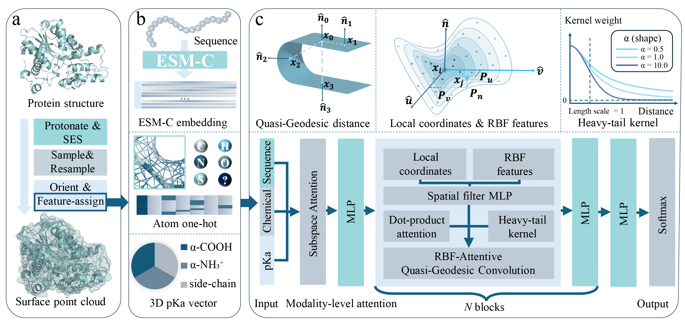

# MetalBind: A Protein Surface-Aware Multimodal Framework for Residue-Level Metal-Binding Site Identification

**MetalBind** is a multimodal framework for accurate, scalable residue‑level prediction of metal‑binding sites across diverse biologically relevant metals. The framework is illustrated in Figure 1. MetalBind integrates three complementary data modalities: (i) advanced sequence representations from a contemporary protein language model (ESM‑C family embeddings) to capture evolutionary and long‑range sequence dependencies; (ii) explicit atomic and physicochemical features, including atom types and residue pKa estimates, to encode local reactivity; and (iii) a surface point‑cloud representation paired with geometry‑aware attention mechanisms and spatial‑filter multilayer perceptrons (MLPs) that encode radial basis‑function (RBF) features of the atomic neighborhood. By fusing surface‑point geometric learning with physicochemical features and pLM embeddings, MetalBind (a) retains the high‑throughput, alignment‑free benefits of pLM‑based predictors, (b) incorporates explicit structural cues critical for small‑ligand coordination, and (c) achieves precise residue‑level predictions for 13 biologically relevant metal ions.

---



*Figure 1. Overview of MetalBind.*

---

## Standard standalone software prerequisites

* [Conda](https://docs.conda.io/en/latest/miniconda.html) — recommended for environment management.
* [Python](https://www.python.org/) (v3.7.12) — MetalBind is tested with this Python version.
* [reduce](https://github.com/rlabduke/reduce) (v3.23) — add missing protons to protein structures if needed.
* [MSMS](https://ccsb.scripps.edu/msms/downloads/) (v2.6.1) — compute the solvent‑accessible surface/triangulated mesh of proteins.

> Note: MetalBind is designed to work with contemporary protein language model embeddings (ESM‑C). Because MetalBind leverages pLM embeddings for evolutionary/contextual information, running multiple‑sequence alignment tools (e.g. HHblits) is **not required** for basic usage. If you prefer to include alignment/HMM features, you may optionally integrate them into the preprocessing pipeline, but this is not necessary for the default workflow.

## Python packages (versions used in development)

* [Pymesh*](https://pymesh.readthedocs.io/en/latest/installation.html) (v0.3). For mesh of protein management and downsampling.
* [BioPython*](https://github.com/biopython/biopython) (v1.78). To parse PDB files.
* [Pytorch*](https://pytorch.org/) (v1.10.1). Pytorch with GPU version. Use to model, train, and evaluate the actual neural networks.
* [pykeops*](https://www.kernel-operations.io/keops/index.html) (v2.1). For computation of all point interactions of a protein surface.
* [Pytorch-geometric*](https://pytorch-geometric.readthedocs.io/en/latest/index.html) (v2.0.4). For geometric neural networks.
* [NumPy*](https://numpy.org/) (v1.21.6). For numerical utilities and array handling.
* [scikit-learn*](https://scikit-learn.org/) (v1.0.2). For point cloud space searching and model evaluation.


## Repository layout (high level)

```
MetalBind/
├─ compute_surface/         # Functions related to the calculation of protein surfaces
├─ dataloader/              # Functions required for data loading
├─ Dataset/                 # Place raw PDBs and embedding files here
├─ Dataset_lists/           # The divided training and test set protein lists
├─ default_config/          # Manage the default paths of some software
├─ img/                     # Figure_1.png
├─ models/                  # The code of the MetalBind core network
├─ Pretrained_model/        # The parameters of the already trained network can be loaded for prediction
├─ Arguments.py/            # Analyze the relevant parameters
├─ MetalBindProcessor/      # Functions for preprocessing the protein datasets
├─ predict.py/              # Prediction-related code
├─ predict.sh/              # Control predict.py
├─ prepare_one.py/          # Code for preprocessing the protein datasets
├─ prepare_one.sh/          # Control prepare_one.py
├─ train.py/                # Training-related code
├─ train.sh/                # Control train.py
├─ LICENSE/                 # MIT License
└─ README.md                # This file
```

## Specific usage

Below are the typical pipeline steps to prepare data, train, and run predictions.

### 1. Install standard software and Python environment

1. Create and activate a conda environment (example):

```bash
conda create -n metalbind python=3.7.12 -y
conda activate metalbind
```

2. Install required Python packages.

3. Make sure `reduce` and `msms` executables are accessible (set their paths in `default_config/bin_path.py`).

### 2. Prepare PDB files and dataset directory

All PDB files of 13 kinds of Metal-binding proteins and their embeddings are uploaded to (https://doi.org/10.5281/zenodo.17529681). Download the Dataset.zip, move it to MetalBind/ and then unzip. 

### 3. Preprocessing: build surface point clouds and features

Change (ligand) in prepare_one.sh to handle different datasets and run:

```
sh prepare_one.sh
```

### 4. Training from scratch. 

Change the ligand type and pre-trained model path (checkpoints_dir) in predict.sh and run:

```
sh train.sh
```

### 5. Predicting / evaluation

Predicting the test set of each metal binding protein, change the ligand type and pre-trained model path (checkpoints_dir) in train.sh and run:

```
sh predict.sh
```

### 5. Predicting binding sites of proteins not existing in Dataset_lists.
There is an easy using webserver www.zpliulab.cn/MetalBind.

## License
MetalBind is released under an [MIT License](LICENSE).
